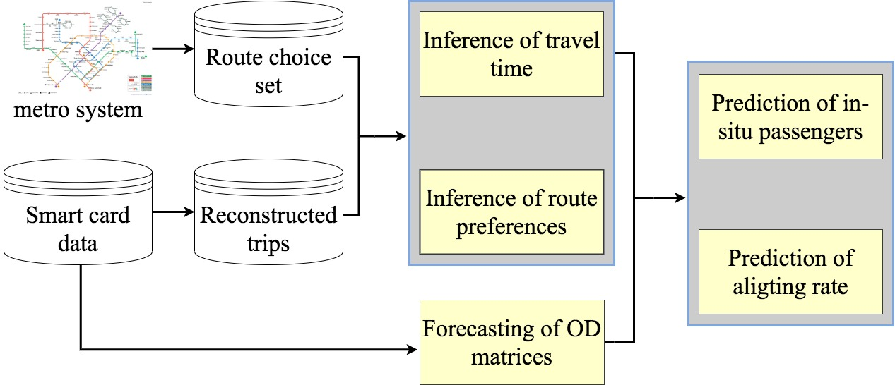

# **短期地铁网客流量预测**

本项目提出一个概率模型（PIPE）用于预测地铁网的客流量：1）包括各时间段各地铁站进出口人流量；2）任意时间点站与站之间客流量；3）以及站台客流量。

通过精准预测客流量，一方面，我们能够实时监测地铁网的客流量分布情况，对地铁系统的运作有更好的了解；另一方面能预知即将出现的客流高峰，从而有针对性地进行人为干预（例如调节地铁时间表，安排站台疏导人员），以减少拥挤发生及提高乘客乘车体验。

如下图所示，本模型主要的预测任务包括：
- 时间序列的Origin-Destination(OD)矩阵预测
- 地铁网每两站之间的不同路径的旅行时间概率分布拟合
- 多路径情况下的选择偏好估计
  

模型框架图

 

模型借助已有成熟机器学习算法，及截断高斯混合分布（EM算法求解），实现了对地铁客流量的精准预测。下面为预测结果示例：

新加坡某天早上9点地铁网客流量预测结果

 

新加坡City Hall地铁站某天的出站人数预测

 

### project 1

description

 

### project 1

description

